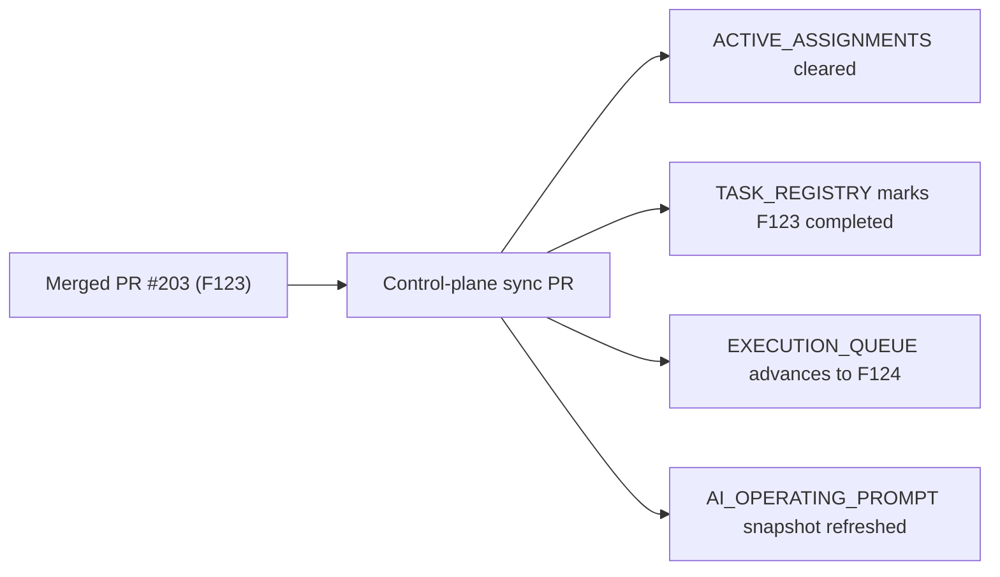

# PR Note: Post-203 F123 Control-Plane Sync

## Summary

- clears the stale `F123_CASEPACK_AND_EVALUATION_DATASET_EXPANSION` assignment from `main`
- marks `F123` completed in the registry and keeps status counts consistent
- advances the execution queue to the final remaining future-backlog task
- refreshes the AI operating prompt snapshot to include the merged evaluation casepack dataset

## Architecture Impact

- no runtime or product architecture changes
- no `ai_first/architecture/MAIN_SYSTEM_MAP.md` update required for this sync-only PR

## Validation

- `python -m json.tool ai_first/TASK_REGISTRY.json >/dev/null`
- registry consistency check
- `git diff --check`
