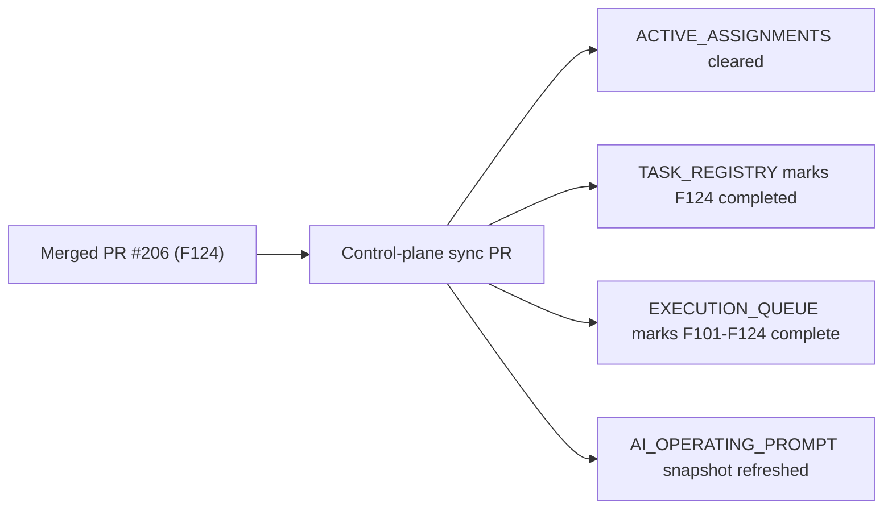

# PR Note: Post-206 F124 Control-Plane Sync

## Summary

- clears the stale `F124_EVIDENCE_AUTOMATION_REFRESH` assignment from `main`
- marks `F124` completed in the registry and closes the `F101-F124` future backlog loop
- refreshes queue and prompt snapshots so the repo returns to a terminal no-active-lane state

## Architecture Impact

- no runtime or product architecture changes
- no `ai_first/architecture/MAIN_SYSTEM_MAP.md` update required for this sync-only PR

## Validation

- `python -m json.tool ai_first/TASK_REGISTRY.json >/dev/null`
- registry consistency check
- `git diff --check`
