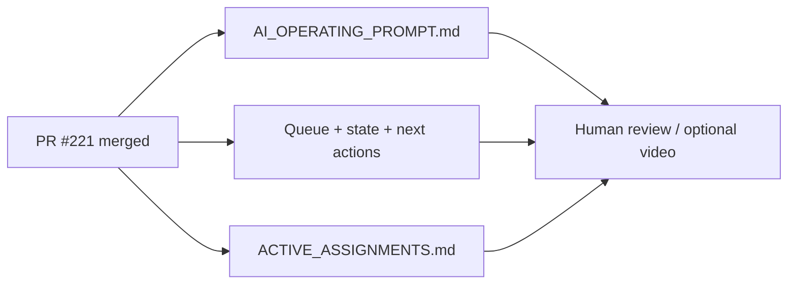

# PR Note: Post-221 Browser Recapture Sync

## Summary

This PR updates the AI-first control plane after PR `#221` merged the post-Phase-2 browser screenshot recapture. It clears the now-stale active-lane state, marks browser evidence freshness as part of the merged baseline, and returns the repository to a final human-review terminal state.

## Mermaid Diagram



## Architecture Impact

`ai_first/architecture/MAIN_SYSTEM_MAP.md` is not updated. This lane only syncs operating docs after a merged evidence refresh.

## Validation

```bash
rg -n "#221|browser recapture|human review|optional video|OPS_POST_221_BROWSER_RECAPTURE_SYNC" ai_first docs/superpowers/tasks docs/superpowers/pr-notes -S
git diff --check
```
