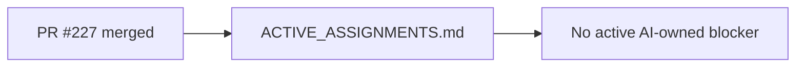

# PR Note: Post-227 Active-Assignments Merge Sync

## Summary

This PR closes the last self-referential control-plane drift after PR `#227` merged. It updates only the active-assignment mirror and required packet/log so the merged lane is recorded as merged rather than still awaiting review.

## Mermaid Diagram



## Architecture Impact

`ai_first/architecture/MAIN_SYSTEM_MAP.md` is not updated. This lane only finalizes a control-plane mirror after a docs-only merge.

## Validation

```bash
rg -n "OPS_ACTIVE_ASSIGNMENTS_TERMINAL_SYNC|OPS_POST_227_ACTIVE_ASSIGNMENTS_SYNC|#227|ready-for-review|merged" ai_first/ACTIVE_ASSIGNMENTS.md ai_first/daily/2026-04-28.md docs/superpowers/tasks docs/superpowers/pr-notes -S
git diff --check
```
