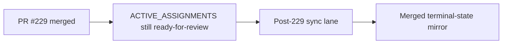

# PR Note: Post-229 Active Assignments Merge Sync

## Summary

- mark `OPS_SCREENSHOT_TRUTH_SYNC` merged after PR `#229`
- record the tiny post-merge repair lane in the daily log
- leave prompt, queue, contest evidence, and runtime files unchanged

## Mermaid Diagram

## Architecture Impact

`ai_first/architecture/MAIN_SYSTEM_MAP.md` is not updated. This lane only repairs the active-assignment mirror and daily log.
