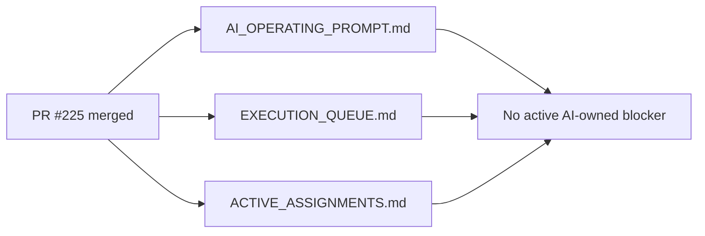

# PR Note: Post-Active-Assignments Terminal Sync

## Summary

This PR removes the last stale active-assignment contradiction after PR `#225` already merged. It updates only the short-lived coordination mirror plus the required docs packet/log so `ACTIVE_ASSIGNMENTS.md` matches the terminal state already stated by the authoritative prompt and queue.

## Mermaid Diagram



## Architecture Impact

`ai_first/architecture/MAIN_SYSTEM_MAP.md` is not updated. This lane only repairs a control-plane mirror and does not change product/runtime architecture.

## Validation

```bash
rg -n "OPS_ACTIVE_ASSIGNMENTS_TERMINAL_SYNC|OPS_C211_REGISTRY_REPAIR|#225|ready-for-review|merged" ai_first/ACTIVE_ASSIGNMENTS.md ai_first/daily/2026-04-28.md docs/superpowers/tasks docs/superpowers/pr-notes -S
git diff --check
```
