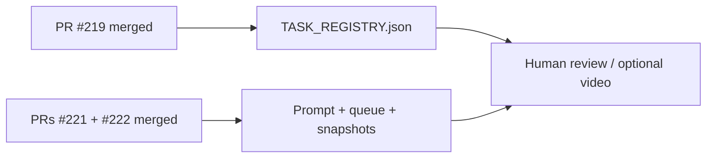

# PR Note: Post-C211 Terminal Sync

## Summary

This PR closes the last control-plane inconsistency after the optional Phase 2 polish train and the browser-evidence refresh merged. It marks `C211` completed in the registry, removes stale “pending optional polish” language from compact mirrors, and restores one coherent terminal wait state.

## Mermaid Diagram



## Architecture Impact

`ai_first/architecture/MAIN_SYSTEM_MAP.md` is not updated. This lane only syncs task tracking and operating mirrors.

## Validation

```bash
python3 -m json.tool ai_first/TASK_REGISTRY.json >/dev/null
rg -n "C211|#219|#221|#222|human review|optional video|browser recapture|OPS_POST_C211_TERMINAL_SYNC" ai_first docs/superpowers/tasks docs/superpowers/pr-notes -S
git diff --check
```
