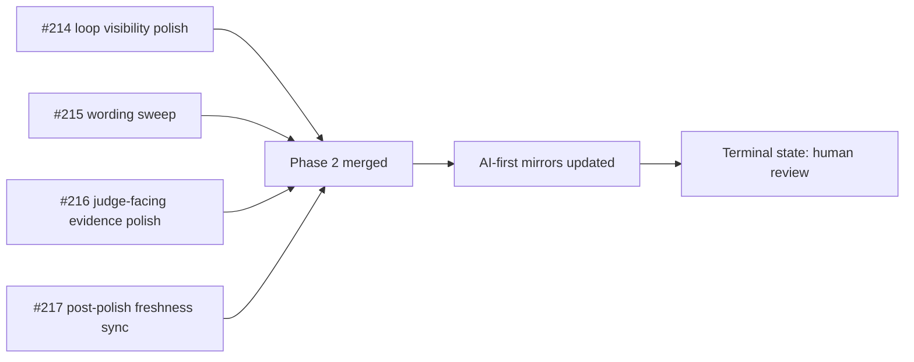

# PR Note: Post Phase 2 Polish Sync

## Summary

- syncs AI-first mirrors after optional Phase 2 polish merged through PRs `#214`, `#215`, `#216`, and `#217`
- removes stale active Session C state from the control plane
- resets the terminal repo state to human review plus optional future browser recapture if screenshot freshness should return to `Current`

## Architecture impact

- `ai_first/architecture/MAIN_SYSTEM_MAP.md` not updated
- reason: this lane only updates operating mirrors and task status after already-merged docs/frontend work

## Mermaid

