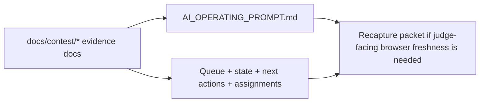

# PR Note: Post-Screenshot Truth Sync

## Summary

This PR restores control-plane truth after verifying that the authoritative contest evidence docs still mark browser-backed screenshots as stale. It updates only the AI-first prompt and compact mirrors so they stop overstating browser screenshot freshness while keeping command-backed smoke validation marked current.

## Mermaid Diagram



## Architecture Impact

`ai_first/architecture/MAIN_SYSTEM_MAP.md` is not updated. This lane only repairs control-plane mirrors to match existing contest evidence truth.

## Validation

```bash
rg -n "stale|browser screenshot|command-backed|Current|recapture|OPS_SCREENSHOT_TRUTH_SYNC" ai_first docs/superpowers/tasks docs/superpowers/pr-notes -S
git diff --check
```
