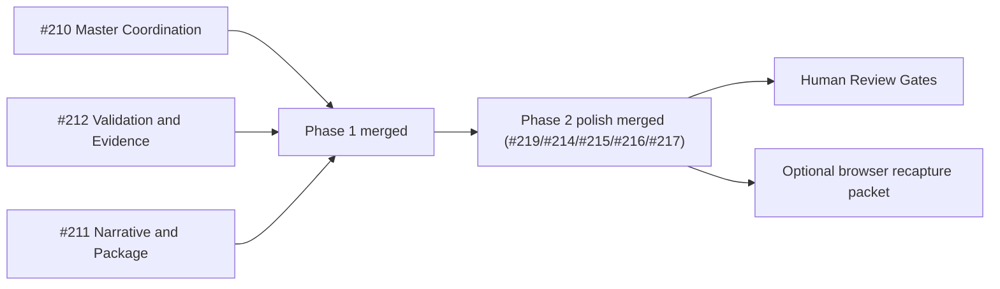

# PR Note: Post Submission-Close Control-Plane Sync

## Summary

- mark submission-close Phase 1 tasks as merged and completed
- refresh control-plane mirrors again after the optional Phase 2 train finished so `C211-C215` is represented correctly
- keep the next step bounded to human review, explicit browser recapture, optional video, or another newly opened packet

## Architecture Impact

- No runtime or product modules changed.
- This PR only updates the AI-first control plane and task-tracking mirrors.
- `ai_first/architecture/MAIN_SYSTEM_MAP.md` was not updated because no system contract changed.

## Mermaid

