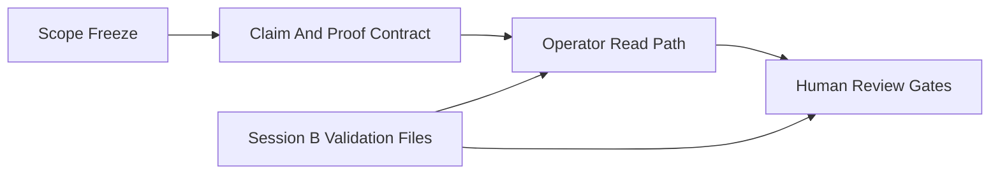

# PR Note: Session A Submission Scope Freeze

## Summary

This PR freezes the contest narrative around one teacher-controlled adaptive tutoring loop, adds a bounded claim-and-proof contract for submission wording, and converts the final manual review path into explicit gates without touching validation-owned evidence files.

## Architecture Impact

- No runtime or product modules changed.
- Contest-facing docs now share one authoritative loop and one operator read path.
- Session B remains the source of truth for validation and evidence freshness.

## Mermaid

