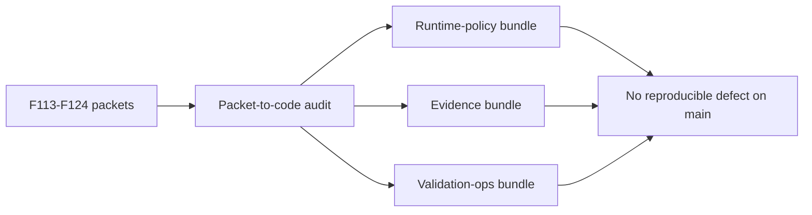

# Session B Future Backlog Regression Audit

## Summary

This docs-only audit re-reviewed the merged Session B backlog slices `F113-F124` against their original bounded packets and reran grouped validation bundles on current `main`.

Result: no reproducible defect was found in the canonical merged implementations.

The only mismatch encountered during the audit was historical: a stale duplicate `F123` lane had different file-path assumptions from the canonical merged `F123` lane. That mismatch did not expose a bug on `main`.

## Reviewed Units

- Runtime policy and binding: `F113`, `F114`, `F115`
- Evidence and student model: `F116`, `F117`, `F118`, `F119`, `F120`
- Validation ops and roster/data contracts: `F121`, `F122`, `F123`, `F124`

## Validation Commands

- `pytest tests/core/test_capabilities_runtime.py tests/services/agent_spec/test_service.py tests/services/runtime_policy/test_compiler.py tests/api/test_unified_ws_turn_runtime.py tests/api/test_agent_specs_router.py -q`
- `pytest tests/services/evidence/test_diagnosis.py tests/services/evidence/test_intervention_effectiveness.py tests/api/test_assessment_router.py tests/api/test_dashboard_router.py -q`
- `pytest tests/services/session/test_sqlite_store.py tests/services/evidence/test_pilot_feedback.py tests/evidence/test_casepack_dataset.py tests/scripts/test_refresh_evidence_status.py tests/api/test_system_router.py tests/api/test_dashboard_router.py -q`
- `python3 -m json.tool ai_first/evidence/evidence_status.json >/dev/null`
- `python3 -m json.tool ai_first/evidence/casepack.json >/dev/null`

## Findings

- None.

## Residual Risks

- This audit confirmed the highest-risk grouped validations on current `main`, not every possible manual contest flow permutation.
- The warnings emitted during the larger pytest bundles were existing `DeprecationWarning` noise from the environment, not Session B task regressions.
- Human-owned submission review remains out of scope for this lane.

## Architecture Note

- `ai_first/architecture/MAIN_SYSTEM_MAP.md` was not updated because the audit found no behavior correction requiring an architecture change.

