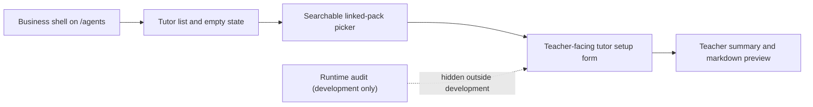

# PR Note: Agents Tutor Setup Cleanup

## Summary

- cleaned only the `Gia sư lớp học / Tutor setup` tab on `/agents`
- hid runtime-only audit tooling from the default teacher-facing surface
- replaced file-name headings and broken boolean semantics with clearer tutor-setup UI
- streamlined linked-pack selection, markdown rendering, empty state, and action labeling

## Architecture impact

- No route map or backend contract changed.
- `ai_first/architecture/MAIN_SYSTEM_MAP.md` was reviewed and did not need an update.
- The runtime lane stays inside the existing `/agents` tutor-setup presentation layer.

## Validation

- `cd web && node --test tests/contest-terminology.test.ts tests/class-tutor-pack-presenters.test.ts tests/sidebar-shell-layout.test.ts tests/sidebar-nav-groups.test.ts`
- `cd web && npx eslint 'app/(workspace)/agents/page.tsx' 'components/agents/SpecPackAuthoringTab.tsx' 'components/agents/class-tutor-pack-presenters.ts' 'components/sidebar/SidebarShell.tsx' 'components/sidebar/WorkspaceSidebar.tsx' 'tests/contest-terminology.test.ts' 'tests/class-tutor-pack-presenters.test.ts' 'tests/sidebar-shell-layout.test.ts' 'tests/sidebar-nav-groups.test.ts'`
- `cd web && npm run build`
- `git diff --check`

## Risks

- The searchable pack picker is intentionally lightweight for this lane and does not yet include full keyboard-combobox semantics.
- Sticky section tabs and version status-pill polish remain deferred by design.
