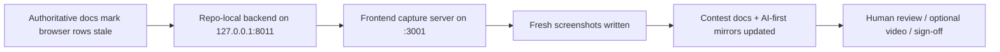

# PR Note: Browser Recapture Refresh

## Summary

This docs-only lane refreshes the stale judge-facing browser screenshots for Knowledge, Tutor, Dashboard, and `/agents` against the current merged contest-facing UI. It also syncs the authoritative contest docs and AI-first mirrors so browser freshness is no longer tracked as an open blocker.

## Mermaid Diagram



## Architecture Impact

`ai_first/architecture/MAIN_SYSTEM_MAP.md` is not updated. This lane only refreshes manual evidence artifacts and control-plane status.

## Validation

```bash
rg -n "Stale|Current|browser recapture|Knowledge Pack|Tutor|Dashboard|/agents|screenshots" docs/contest ai_first docs/superpowers/tasks docs/superpowers/pr-notes -S
git diff --check
```
