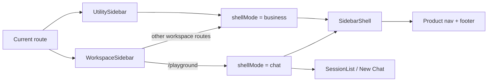

# PR Architecture Note: Business Shell Focus

## Summary

Adds an explicit shell distinction between chat-first and business-first routes so `/playground` keeps the conversation-heavy sidebar while business pages drop the dominant chat-history rail.

## Scope

- `web/components/sidebar/SidebarShell.tsx`
- `web/components/sidebar/WorkspaceSidebar.tsx`
- `web/components/sidebar/UtilitySidebar.tsx`
- `web/tests/sidebar-shell-layout.test.ts`
- `ai_first/ACTIVE_ASSIGNMENTS.md`
- `ai_first/daily/2026-04-30.md`
- `docs/superpowers/plans/2026-04-30-business-shell-focus.md`

## Mermaid Diagram



## Architecture Impact

- The shared sidebar now has an explicit route-mode boundary:
  - `chat` for `/playground`
  - `business` for utility routes and non-chat workspace routes
- This is a presentation-layer architecture improvement only; session APIs and route map remain unchanged.

## Tests

```bash
cd web && node --test tests/sidebar-shell-layout.test.ts tests/sidebar-nav-groups.test.ts
cd web && npx eslint 'components/sidebar/SidebarShell.tsx' 'components/sidebar/WorkspaceSidebar.tsx' 'components/sidebar/UtilitySidebar.tsx' 'tests/sidebar-shell-layout.test.ts' 'tests/sidebar-nav-groups.test.ts'
cd web && npm run build
git diff --check
```

## Main System Map Update

- [x] Not needed, because the route structure and core product workflow are unchanged; this lane only adjusts shell presentation by route mode.
- [ ] Updated `ai_first/architecture/MAIN_SYSTEM_MAP.md`
