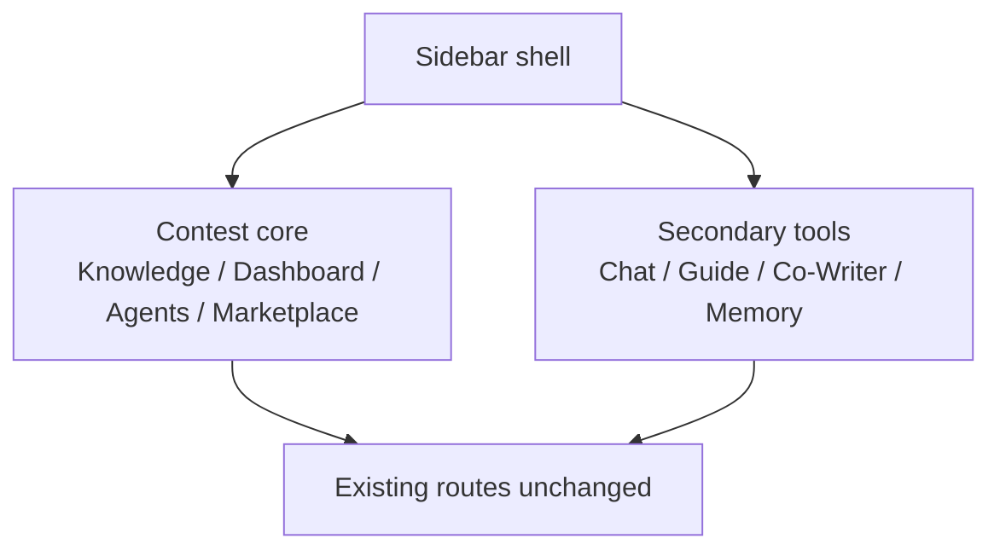

# 2026-04-30 C216 Contest Shell Scope Trim

## Summary

- split the shared sidebar shell into contest-core and secondary tool groups
- kept route targets and session handling intact while demoting inherited tools from the first visual read
- added focused regression coverage for expanded and collapsed shell nav grouping

## Why

The contest audit showed that the default shell still presented inherited DeepTutor tools as peers of the contest loop. This patch keeps every route available, but changes the shell hierarchy so `Knowledge`, `Dashboard`, `/agents`, and `Marketplace` read as the primary product path.

## Validation

- `node --test web/tests/sidebar-nav-groups.test.ts`
- `cd web && npx eslint "components/sidebar/SidebarShell.tsx" "components/sidebar/WorkspaceSidebar.tsx" "components/sidebar/UtilitySidebar.tsx" "app/(workspace)/layout.tsx" "app/(utility)/layout.tsx"`
- `cd web && npm run build`
- `git diff --check`

## Main System Map

- Not updated; this PR changes shell presentation only and does not alter route architecture or backend/runtime contracts.

## Mermaid

