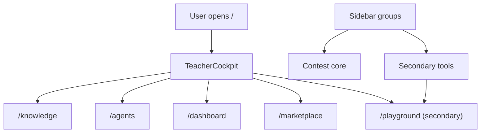

# C217 Teacher Cockpit Default Entry

## Summary

- Replaces the generic chat-first `/` entry with a bounded teacher-first cockpit.
- Keeps the broader exploratory workspace reachable through `/playground` instead of removing it.
- Aligns the default landing and sidebar hierarchy so the contest narrative starts with classroom setup, not tool selection.

## Scope

- Changed:
  - `web/app/(workspace)/page.tsx`
  - `web/components/contest/TeacherCockpit.tsx`
  - `web/components/contest/teacher-cockpit-content.ts`
  - `web/components/sidebar/nav-groups.ts`
  - `web/tests/teacher-cockpit-content.test.ts`
  - `web/tests/sidebar-nav-groups.test.ts`
- Unchanged by design:
  - `web/locales/`
  - `web/app/(workspace)/dashboard/page.tsx`
  - `web/app/(workspace)/agents/page.tsx`
  - backend and API contracts

## Architecture

## Validation

- `node --test web/tests/teacher-cockpit-content.test.ts web/tests/sidebar-nav-groups.test.ts`
- `cd web && npx eslint "app/(workspace)/page.tsx" "components/contest/TeacherCockpit.tsx" "components/contest/teacher-cockpit-content.ts" "components/sidebar/nav-groups.ts"`
- `cd web && npm run build`
- `git diff --check`

## Main System Map

- No update required. This lane changes the bounded default entry presentation, not the underlying system architecture or route inventory.
