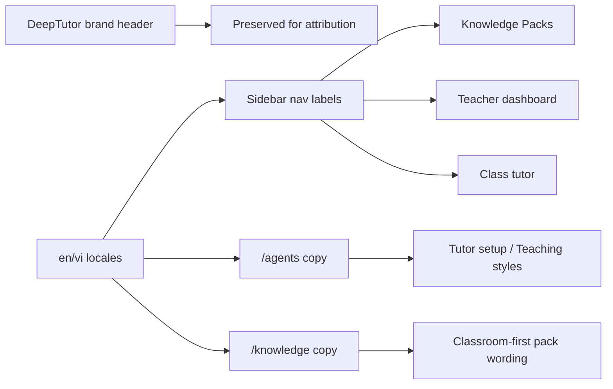

# C218 Contest Brand And Classroom Terminology

## Summary

- keeps `DeepTutor` visible on attribution-facing shell surfaces
- updates contest-path wording so sidebar, `Knowledge`, and `/agents` read like classroom software
- adds focused locale regression coverage for the new English and Vietnamese terminology

## Scope

- Changed:
  - `web/components/sidebar/SidebarShell.tsx`
  - `web/app/(workspace)/agents/page.tsx`
  - `web/app/(utility)/knowledge/page.tsx`
  - `web/locales/en/app.json`
  - `web/locales/vi/app.json`
  - `web/tests/contest-terminology.test.ts`
- Reviewed but intentionally unchanged:
  - `web/app/(workspace)/dashboard/page.tsx`
  - `web/app/(workspace)/page.tsx`
  - runtime routes, APIs, and backend contracts

## Architecture

## Validation

- `python3 -m json.tool ai_first/TASK_REGISTRY.json >/dev/null`
- `python3 -m json.tool web/locales/en/app.json >/dev/null`
- `python3 -m json.tool web/locales/vi/app.json >/dev/null`
- `node --test web/tests/contest-terminology.test.ts`
- `cd web && npx eslint "components/sidebar/SidebarShell.tsx" "app/(workspace)/agents/page.tsx" "app/(workspace)/dashboard/page.tsx" "app/(utility)/knowledge/page.tsx"`
- `cd web && npm run build`
- `git diff --check`

## Main System Map

- No update required. This lane changes wording and presentation only, not the system architecture or route contracts.
