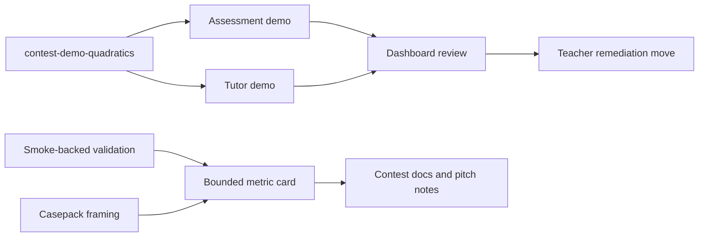

# C219 Classroom Case Study And Bounded Metric Card

## Summary

- packages the contest docs around one explicit Grade 9 quadratics classroom case
- adds one compact metric card that stays inside smoke-backed and casepack-backed proof
- removes pressure to present the repository as a benchmark, pilot, or classroom-outcome study

## Scope

- Changed:
  - `docs/contest/README.md`
  - `docs/contest/DEMO_SCRIPT.md`
  - `docs/contest/CASEPACK_AND_EVALUATION_DATASET.md`
  - `docs/contest/VALIDATION_REPORT.md`
  - `ai_first/competition/product-description.md`
  - `ai_first/competition/pitch-notes.md`
- Unchanged by design:
  - runtime code
  - screenshot freshness state
  - `ai_first/evidence/casepack.json`
  - `docs/contest/EVIDENCE_CHECKLIST.md`

## Architecture

## Validation

- `python3 -m json.tool ai_first/TASK_REGISTRY.json >/dev/null`
- `git diff --check`
- `rg -n "case study|metric|bounded|non-overclaim|grounding|contest-demo-quadratics|validated prototype|not a benchmark|not a classroom outcome" docs/contest ai_first/competition docs/superpowers/tasks docs/superpowers/pr-notes`

## Main System Map

- No update required. This lane changes documentation and evidence framing only.
