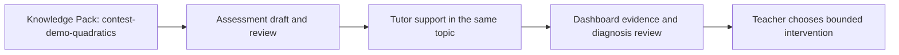

# PR Note: C219 Classroom Case Study And Bounded Metric Card

## Summary

- anchor the contest narrative to one Grade 9 quadratics classroom scenario built around `contest-demo-quadratics`
- add a compact bounded metric card that reports only smoke-backed operational proof already present in the repository
- align contest README, demo script, validation docs, and competition copy so reviewers hear one consistent story

## Architecture Impact

- No runtime or product modules changed.
- This PR only repackages contest-facing documentation and evidence framing.
- `ai_first/architecture/MAIN_SYSTEM_MAP.md` was not updated because the system architecture and feature set did not change.

## Mermaid


```
