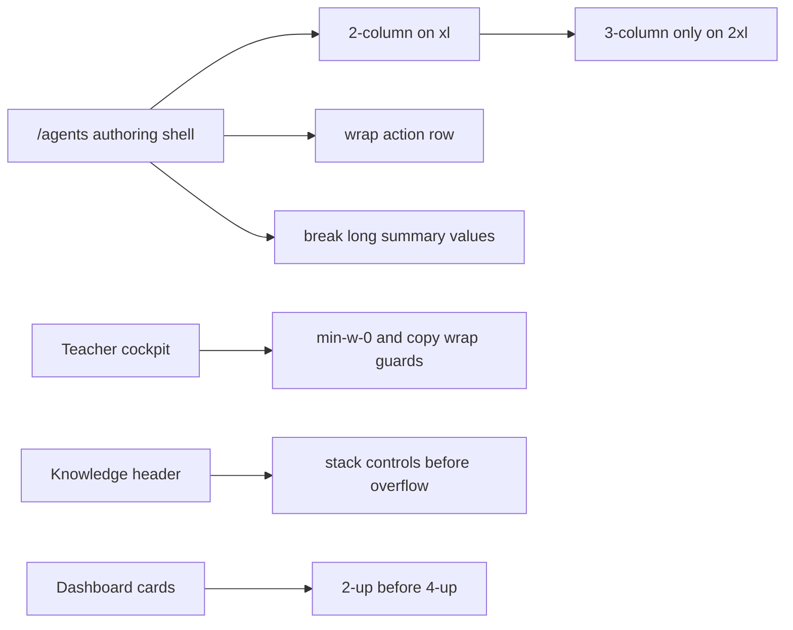

# C220 Contest Layout Breakage Sweep

## Summary

- stabilizes the `/agents` spec-pack authoring screen by restacking the layout earlier and adding wrap guards to controls and summary content
- widens the `/agents` shell and wraps the tab row so the teacher-setup path remains readable on laptop widths
- applies smaller responsive protections to the teacher cockpit, Knowledge header, and dashboard metrics without changing routes or backend contracts

## Scope

- Changed:
  - `web/components/agents/SpecPackAuthoringTab.tsx`
  - `web/app/(workspace)/agents/page.tsx`
  - `web/components/contest/TeacherCockpit.tsx`
  - `web/app/(utility)/knowledge/page.tsx`
  - `web/app/(workspace)/dashboard/page.tsx`
  - `docs/superpowers/plans/2026-04-30-c220-contest-layout-breakage-sweep.md`
  - `ai_first/ACTIVE_ASSIGNMENTS.md`
  - `ai_first/TASK_REGISTRY.json`
  - `ai_first/daily/2026-04-30.md`
- Reviewed but intentionally unchanged:
  - `web/components/contest/CoreLoopVisibilityStrip.tsx`
  - `web/app/(utility)/marketplace/page.tsx`
  - locale files and backend contracts

## Architecture

## Validation

- `cd web && npm install`
- `cd web && npx eslint "components/agents/SpecPackAuthoringTab.tsx" "app/(workspace)/agents/page.tsx" "components/contest/TeacherCockpit.tsx" "components/contest/CoreLoopVisibilityStrip.tsx" "app/(workspace)/dashboard/page.tsx" "app/(utility)/knowledge/page.tsx" "app/(utility)/marketplace/page.tsx"`
- `cd web && npm run build`
- `python3 -m json.tool ai_first/TASK_REGISTRY.json >/dev/null`
- `git diff --check`

## Main System Map

- No update required. This lane changes responsive presentation only, not the system architecture or route contracts.
