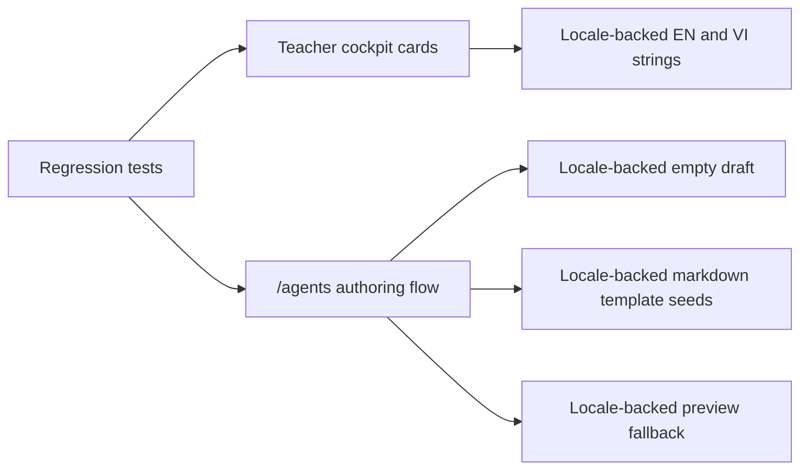

# C221 Contest Vietnamese Coverage Completion

## Summary

- completes the remaining Vietnamese copy on the teacher-first contest path instead of leaving English cockpit and `/agents` fallback text visible
- moves spec-pack seed markdown and empty-state copy behind locale-backed keys so Vietnamese mode no longer leaks English authoring scaffolds
- adds focused regression coverage for the new Vietnamese contest-path strings

## Scope

- Changed:
  - `web/components/agents/SpecPackAuthoringTab.tsx`
  - `web/locales/en/app.json`
  - `web/locales/vi/app.json`
  - `web/tests/contest-vietnamese-coverage.test.ts`
  - `docs/superpowers/plans/2026-04-30-c221-contest-vietnamese-coverage-completion.md`
  - `docs/superpowers/tasks/2026-04-30-c221-contest-vietnamese-coverage-completion.md`
  - `ai_first/ACTIVE_ASSIGNMENTS.md`
  - `ai_first/TASK_REGISTRY.json`
  - `ai_first/daily/2026-04-30.md`
- Reviewed but intentionally unchanged:
  - `web/components/contest/teacher-cockpit-content.ts`
  - `web/components/contest/TeacherCockpit.tsx`
  - `web/app/(workspace)/agents/page.tsx`
  - `web/app/(workspace)/dashboard/page.tsx`
  - `web/app/(utility)/knowledge/page.tsx`
  - `web/app/(utility)/marketplace/page.tsx`
  - routes, backend APIs, and legal attribution surfaces

## Architecture

## Validation

- `python3 -m json.tool web/locales/en/app.json >/dev/null`
- `python3 -m json.tool web/locales/vi/app.json >/dev/null`
- `node --test web/tests/contest-terminology.test.ts web/tests/contest-vietnamese-coverage.test.ts`
- `cd web && npx eslint "components/contest/teacher-cockpit-content.ts" "components/contest/TeacherCockpit.tsx" "components/agents/SpecPackAuthoringTab.tsx" "app/(workspace)/agents/page.tsx" "app/(workspace)/dashboard/page.tsx" "app/(utility)/knowledge/page.tsx" "app/(utility)/marketplace/page.tsx"`
- `cd web && npm run build`
- `python3 -m json.tool ai_first/TASK_REGISTRY.json >/dev/null`
- `git diff --check`

## Main System Map

- No update required. This lane changes contest-path localization only, not the architecture or route contracts.
