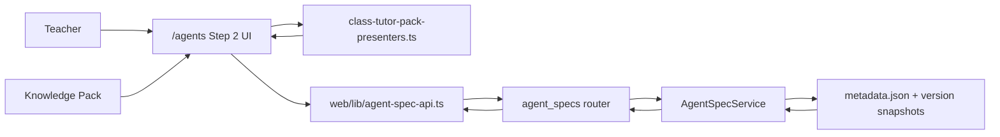

# PR Architecture Note: Class Tutor Pack Flow

## Summary

Reframes `/agents` as the teacher-facing second step after Knowledge Pack setup, and persists a thin `linked_knowledge_pack` relationship so each class tutor is visibly and durably tied to one selected pack.

## Scope

- `deeptutor/api/routers/agent_specs.py`
- `deeptutor/services/agent_spec/service.py`
- `tests/api/test_agent_specs_router.py`
- `tests/services/agent_spec/test_service.py`
- `web/app/(workspace)/agents/page.tsx`
- `web/components/agents/SpecPackAuthoringTab.tsx`
- `web/components/agents/class-tutor-pack-presenters.ts`
- `web/lib/agent-spec-api.ts`
- `web/locales/en/app.json`
- `web/locales/vi/app.json`
- `web/tests/contest-terminology.test.ts`
- `web/tests/class-tutor-pack-presenters.test.ts`

## Mermaid Diagram



## Architecture Impact

- The route structure stays the same: `/knowledge` remains the pack setup flow and `/agents` remains the tutor flow.
- The mental model changes: `/agents` now explicitly behaves like step 2 after pack setup instead of a detached spec editor.
- Agent specs now carry one bounded metadata reference, `linked_knowledge_pack`, to resolve current pack context without duplicating pack metadata into every tutor record.

## Data/API Changes

- Added optional `linked_knowledge_pack` to the agent-spec create/update request payload.
- Added `linked_knowledge_pack` to agent-spec list/detail responses.
- Persisted `linked_knowledge_pack` in `metadata.json` and every version snapshot.

## Tests

```bash
pytest tests/services/agent_spec/test_service.py tests/api/test_agent_specs_router.py -q
cd web && node --test tests/contest-terminology.test.ts tests/class-tutor-pack-presenters.test.ts
cd web && npx eslint 'app/(workspace)/agents/page.tsx' 'components/agents/SpecPackAuthoringTab.tsx' 'components/agents/class-tutor-pack-presenters.ts' 'lib/agent-spec-api.ts' 'tests/contest-terminology.test.ts' 'tests/class-tutor-pack-presenters.test.ts'
cd web && npm run build
git diff --check
```

## Main System Map Update

- [x] Not needed, because the route map is unchanged and this lane only clarifies the teacher-facing relationship between existing Knowledge Pack and Class Tutor surfaces.
- [ ] Updated `ai_first/architecture/MAIN_SYSTEM_MAP.md`
