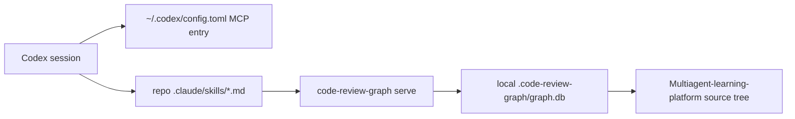

# PR Note: Code Review Graph Integration

## Summary

- integrated `code-review-graph` for this repository's Codex workflow
- captured the repo-local install outputs that the upstream tool actually generates:
  - `.gitignore` entry for `.code-review-graph/`
  - `.claude/skills/*.md`
- built `.code-review-graph/graph.db` locally for verification without keeping it in git
- left application runtime code unchanged

## Architecture Note

## Validation

- `~/Library/Python/3.12/bin/code-review-graph --help`
- `~/Library/Python/3.12/bin/code-review-graph install --platform codex`
- `~/Library/Python/3.12/bin/code-review-graph build`
- `~/Library/Python/3.12/bin/code-review-graph status`
- `git diff --check`

## Main System Map

- no update required
- reason: this lane changes developer tooling integration only, not product/runtime architecture
