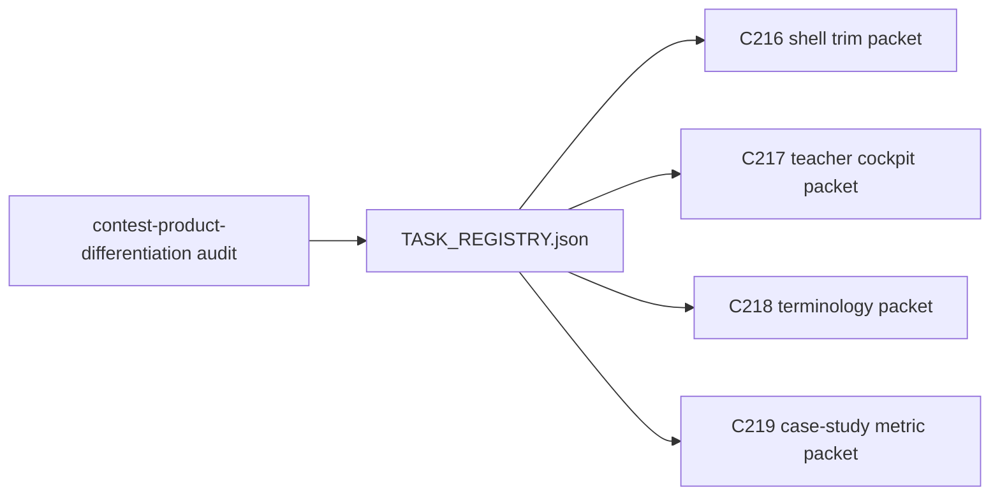

# 2026-04-30 Contest Differentiation Follow-up Packets

## Summary

- audited `ai_first/contest-product-differentiation (1).md` against the current merged repo state
- added four new follow-up registry tasks for contest differentiation hardening: `C216`, `C217`, `C218`, and `C219`
- created bounded execution packets so each follow-up can be implemented independently without reopening scope

## Why

The current repository already implements and documents the teacher-controlled loop, but the audit showed a remaining gap between the contest narrative and the default product shell:

- inherited DeepTutor-style shell and chat-first entry still dilute the first impression
- contest-facing wording and product identity still need a bounded classroom-first sweep
- the docs still need one compact case-study and metric framing layer for judges

This PR does not implement those runtime or wording changes directly. It prepares the control plane so later AI workers can execute the differentiation follow-ups one packet at a time.

## Validation

- `python3 -m json.tool ai_first/TASK_REGISTRY.json >/dev/null`
- `python3 -m json.tool web/locales/en/app.json >/dev/null`
- `python3 -m json.tool web/locales/vi/app.json >/dev/null`
- `git diff --check -- ai_first/TASK_REGISTRY.json ai_first/daily/2026-04-30.md docs/superpowers/tasks/2026-04-30-c216-contest-shell-scope-trim.md docs/superpowers/tasks/2026-04-30-c217-teacher-cockpit-default-entry.md docs/superpowers/tasks/2026-04-30-c218-contest-brand-and-classroom-terminology.md docs/superpowers/tasks/2026-04-30-c219-classroom-case-study-and-bounded-metric-card.md docs/superpowers/pr-notes/2026-04-30-contest-differentiation-follow-up-packets.md`

## Main System Map

- Not updated; this PR only changes task planning, registry state, and handoff documentation.

## Mermaid

