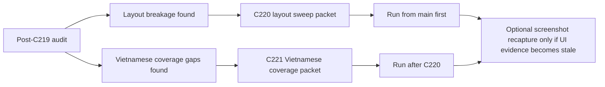

# Contest UI Recovery Task Publication

## Summary

- re-audits the current contest path after `C216-C219`
- publishes `C220` for layout breakage and `C221` for incomplete Vietnamese coverage
- reopens the control-plane queue so the repo no longer reports a human-only state while these visible UI blockers remain

## Scope

- Changed:
  - `ai_first/TASK_REGISTRY.json`
  - `ai_first/AI_OPERATING_PROMPT.md`
  - `ai_first/EXECUTION_QUEUE.md`
  - `ai_first/NEXT_ACTIONS.md`
  - `ai_first/daily/2026-04-30.md`
  - `docs/superpowers/tasks/2026-04-30-contest-ui-recovery-task-publication.md`
  - `docs/superpowers/tasks/2026-04-30-c220-contest-layout-breakage-sweep.md`
  - `docs/superpowers/tasks/2026-04-30-c221-contest-vietnamese-coverage-completion.md`
- Reviewed but intentionally unchanged:
  - runtime source files under `web/`
  - backend code under `deeptutor/`
  - contest evidence docs under `docs/contest/`

## Architecture

## Validation

- `python3 -m json.tool ai_first/TASK_REGISTRY.json >/dev/null`
- `rg -n "C220_|C221_|layout breakage|Vietnamese coverage" ai_first/TASK_REGISTRY.json ai_first/AI_OPERATING_PROMPT.md ai_first/EXECUTION_QUEUE.md ai_first/NEXT_ACTIONS.md docs/superpowers/tasks -S`
- `git diff --check`

## Main System Map

- No update required. This lane only publishes follow-up packets and queue state; it does not change runtime architecture or contracts.
