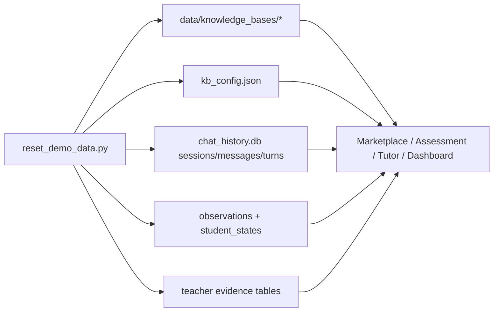

# PR Architecture Note: Realistic Demo Seed Data

## Summary

Expands the local contest demo reset utility so one command now rebuilds a realistic, diverse, demo-safe dataset across marketplace metadata, imported workspace packs, classroom assessment history, tutor replay sessions, and dashboard intervention evidence.

## Scope

- local-only demo reset utility
- knowledge-pack metadata and preview files
- SQLite-backed session seeds
- SQLite-backed teacher evidence seeds
- contest reset and smoke runbook updates

## Mermaid Diagram



## Main System Map Update

`ai_first/architecture/MAIN_SYSTEM_MAP.md` was not updated. This lane extends a local-only demo helper and its seed coverage, but it does not change runtime architecture, route ownership, or production data flow.

## Validation

```bash
rtk pytest tests/scripts/test_reset_demo_data.py -v
rtk .venv/bin/python -m scripts.contest.reset_demo_data --project-root . --api-base http://localhost:8001
rtk rg -n "demo data|reset|seed|smoke|Knowledge Pack|contest|Mermaid" scripts tests docs/contest docs/superpowers/tasks docs/superpowers/pr-notes ai_first
rtk python3 -m compileall scripts
rtk git diff --check
```

## Notes

- The utility deletes and recreates only demo-owned rows and files in its bounded namespace.
- No generated `data/` outputs are committed.
