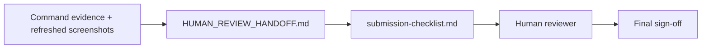

# PR Note: Final Human Review Handoff Refinement

## Summary

This docs-only lane tightens the final human-review path after browser evidence refresh is complete. It updates the shortest manual gate sheet and aligns the compact submission checklist so the remaining work is unambiguously human-only: wording review, IP commitment, optional video decision, and final sign-off.

## Mermaid Diagram



## Architecture Impact

`ai_first/architecture/MAIN_SYSTEM_MAP.md` is not updated. This lane only refines final human-review docs.

## Validation

```bash
rg -n "2026-04-25|2026-04-26|stale|screenshot|IP commitment|Final package reviewed by humans|video" docs/contest/HUMAN_REVIEW_HANDOFF.md ai_first/competition/submission-checklist.md docs/superpowers/tasks docs/superpowers/plans docs/superpowers/pr-notes -S
git diff --check
```
