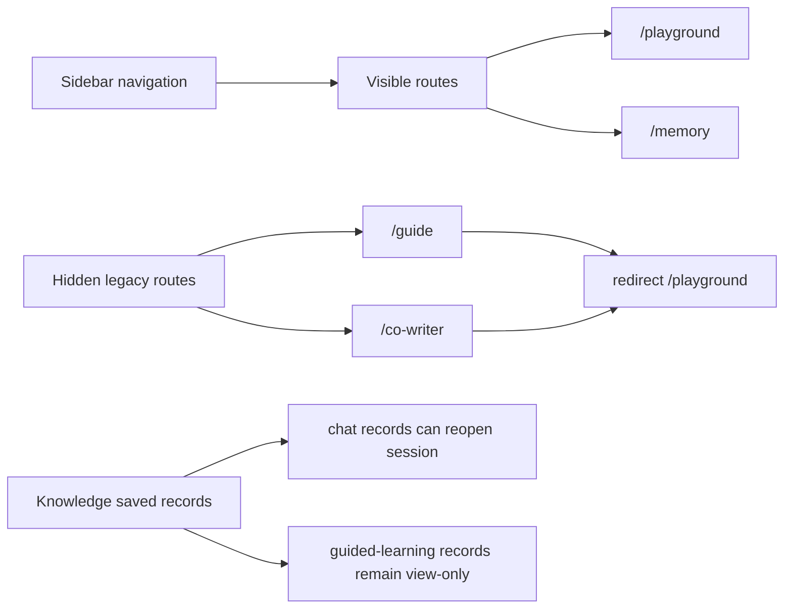

# PR Note: Hide Guided Learning and Co-Writer

## Summary

- Removed `Guided Learning` and `Co-Writer` from the visible sidebar navigation.
- Redirected direct access to `/guide` and `/co-writer` back to `/playground` through route-level layouts.
- Kept feature implementation code intact and only removed public frontend entry points.

## Architecture

## Main System Map

- `ai_first/architecture/MAIN_SYSTEM_MAP.md` not updated.
- Reason: this lane only narrows visible frontend entry points and adds reversible route redirects; it does not change the underlying system architecture or backend contracts.
