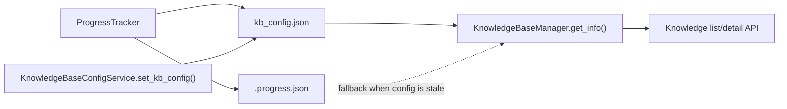

# PR Note: Knowledge Progress Persistence

## Summary

- fixed stale KB config writes so metadata updates no longer erase runtime `status/progress`
- added API read fallback from `.progress.json` when `kb_config.json` is missing progress data
- kept the `/knowledge` frontend unchanged because it already renders the right states once the backend contract is stable again

## Architecture impact

- No route map change.
- `ai_first/architecture/MAIN_SYSTEM_MAP.md` was reviewed and did not require an update.
- The fix stays inside KB config persistence and KB info assembly.

## Validation

- `pytest tests/knowledge/test_progress_tracker.py tests/api/test_knowledge_router.py -q`
- `git diff --check`

## Risks

- This lane restores correct status visibility for stale entries, but it does not invent success where indexing truly failed; real model/provider failures will now simply surface more accurately.
