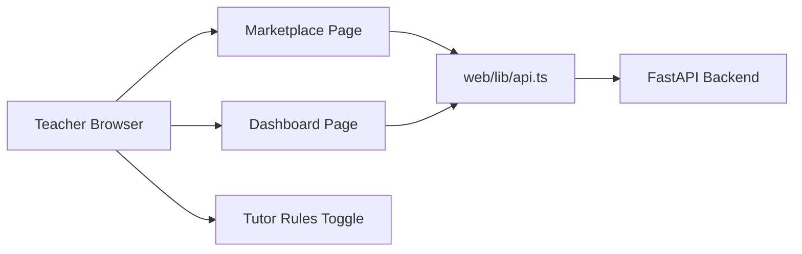

# PR Architecture Note: Marketplace Dashboard Fetch Recovery

## Summary

Fixes a frontend runtime regression where teacher-facing fetches could target the wrong API base URL and fail with generic browser `Failed to fetch` errors, then hardens the linked tutor rules toggle so long Vietnamese labels do not break the layout.

## Scope

- frontend API base URL resolution
- marketplace and dashboard transport recovery path
- linked tutor rules toggle layout
- focused frontend regression tests

## Mermaid Diagram



## Main System Map Update

`ai_first/architecture/MAIN_SYSTEM_MAP.md` was not updated. This lane fixes URL resolution and a bounded UI control layout, but it does not change product routes, data flow, or architecture ownership.

## Validation

```bash
cd web && node --test tests/api-base-url.test.ts
cd web && node --test tests/agents-boolean-field-layout.test.ts
git diff --check
```

## Notes

- `npx eslint` could not run in this worktree because `web/eslint.config.mjs` cannot resolve `eslint-config-next`.
