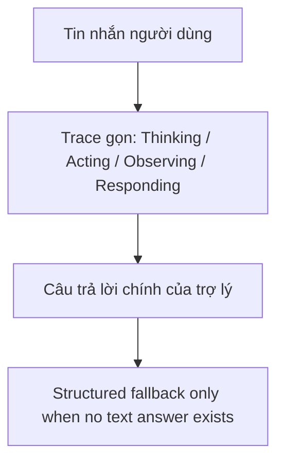

# PR Note: Playground Chat Consumer Trace

## Summary

This lane pulls `/playground` chat turns back toward the original consumer-chat presentation without changing any backend capability contracts. The main work is visual: compact trace rows, smaller user bubbles, lighter assistant surfaces, and removal of end-user metadata noise.

## Architecture impact

- No runtime protocol changes
- No route changes
- No capability changes
- UI composition in `web/app/(workspace)/playground/page.tsx` now uses one shared turn renderer for all playground chat testers, reducing repeated layout drift

## MAIN_SYSTEM_MAP

`ai_first/architecture/MAIN_SYSTEM_MAP.md` was not updated because this lane only changes presentation inside the existing `/playground` workspace shell.
