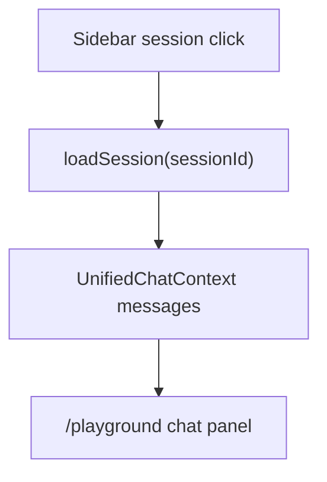

# PR Note: Playground Chat History Restore

## Summary

This lane fixes a regression where clicking a previous chat session in the sidebar no longer restored that conversation inside `/playground`. The fix reconnects only the standard `chat` mode to `UnifiedChatContext`, while leaving the other capability testers untouched for the next UI-scope lane.

## Architecture impact

- No backend changes
- No session schema changes
- No capability removals in this lane
- `/playground` now uses the shared chat session state again when the active capability is `chat`

## MAIN_SYSTEM_MAP

`ai_first/architecture/MAIN_SYSTEM_MAP.md` was not updated because this lane restores an existing session-history integration and does not change the system architecture.
