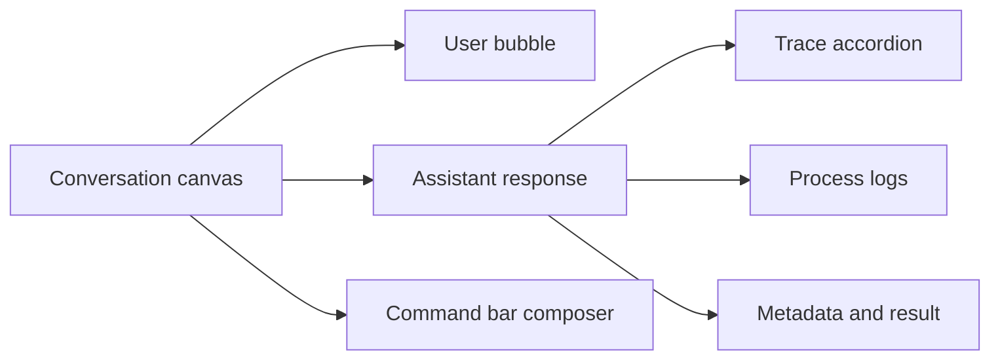

# PR Note: Playground Chat Visual Refinement

## Summary

- softened the `/playground` chat bubbles and command-bar controls so the conversation feels lighter and calmer
- kept trace, process, and metadata surfaces visible, but made them default-collapsed and visually more subdued
- reduced the raw debug-panel feel by unifying cards, borders, and backgrounds into a quieter presentation

## Architecture

## Main System Map

- `ai_first/architecture/MAIN_SYSTEM_MAP.md` not updated.
- Reason: this lane only refines `/playground` presentation and default-open UI states without changing route behavior, backend contracts, or overall system architecture.
