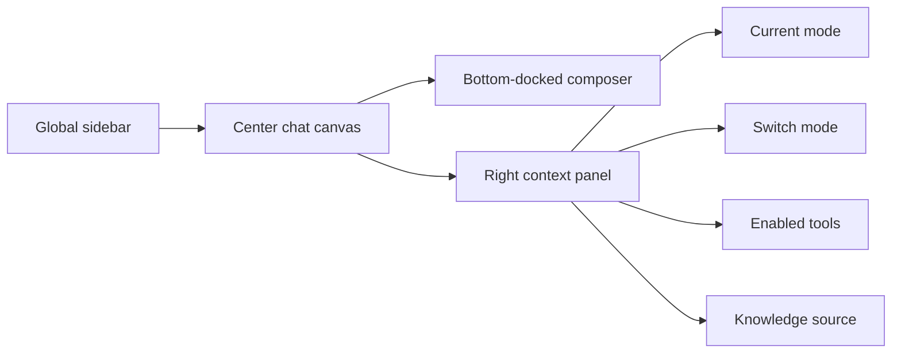

# PR Note: Playground Chat Workspace Polish

## Summary

- Reduced the `/playground` chat header to a tighter, title-only strip.
- Simplified the far-right context panel into clearer grouped cards for mode summary, switching, tool toggles, and knowledge source.
- Docked the conversation composers to the bottom with a smaller footprint and expanded Vietnamese coverage for the touched workspace strings.
- Increased conversation hierarchy by making user turns darker/right-aligned and assistant turns wider/more document-like.

## Architecture

## Main System Map

- `ai_first/architecture/MAIN_SYSTEM_MAP.md` not updated.
- Reason: this lane only refines `/playground` presentation, copy, and panel grouping without changing product architecture, routes, or backend behavior.
