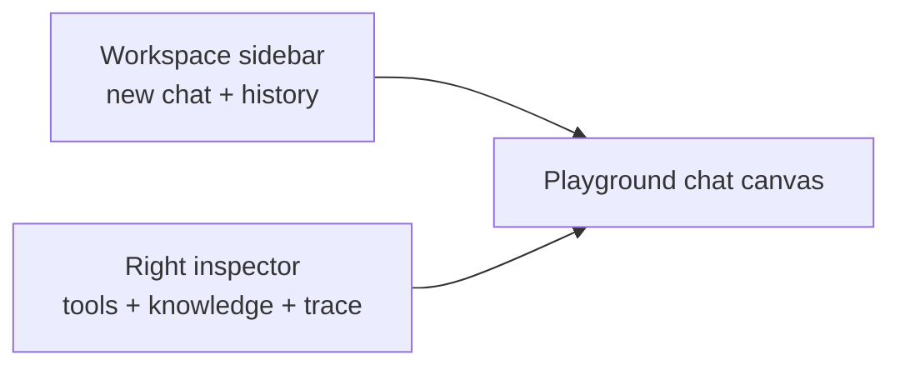

# Playground Chat Workspace PR Note

## Summary

- Replaced the `/playground` card-style demo surface with a workspace-style chat shell.
- Repositioned the global workspace sidebar so `/playground` owns new-chat routing and chat-history visibility.
- Expanded Vietnamese-first copy across the refreshed workspace surface and related shared session/sidebar labels.

## Architecture

## Files Changed

- `web/app/(workspace)/playground/page.tsx`
- `web/components/chat/home/PlaygroundWorkspaceShell.tsx`
- `web/components/chat/home/PlaygroundRightPanel.tsx`
- `web/components/SessionList.tsx`
- `web/components/sidebar/SidebarShell.tsx`
- `web/components/sidebar/WorkspaceSidebar.tsx`
- `web/components/sidebar/nav-groups.ts`
- `web/locales/en/app.json`
- `web/locales/vi/app.json`
- `web/tests/contest-vietnamese-coverage.test.ts`
- `web/tests/sidebar-nav-groups.test.ts`

## Validation

- `cd web && npx --yes tsx --test tests/contest-vietnamese-coverage.test.ts tests/sidebar-nav-groups.test.ts`
- `cd web && npx eslint "app/(workspace)/playground/page.tsx" "components/chat/home/PlaygroundWorkspaceShell.tsx" "components/chat/home/PlaygroundRightPanel.tsx" "components/SessionList.tsx" "components/sidebar/SidebarShell.tsx" "components/sidebar/WorkspaceSidebar.tsx" "components/sidebar/nav-groups.ts"`
- `cd web && npm run build`
- `git diff --check`

## Architecture Map

- `ai_first/architecture/MAIN_SYSTEM_MAP.md` not updated.
- Reason: this lane changes the workspace shell presentation and route emphasis, but it does not introduce a new route, backend service, or product workflow stage.
