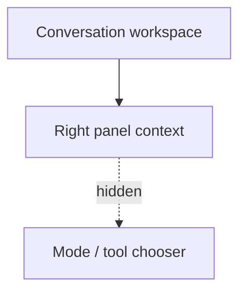

# PR Note: Playground Hide Mode Switcher

## Summary

This lane removes the visible `Năng lực / Công cụ` chooser from the `/playground` right panel for the current product version. The underlying capability and tool logic stays in place, so the chooser can be restored later without reworking runtime behavior.

## Architecture impact

- No backend changes
- No route changes
- No capability removal in this lane
- Right-panel presentation is simplified by no longer mounting the chooser surface

## MAIN_SYSTEM_MAP

`ai_first/architecture/MAIN_SYSTEM_MAP.md` was not updated because this lane only hides a right-panel UI surface and does not change system architecture.
