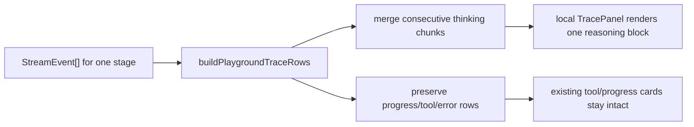

# PR Note: Playground Reasoning Wrap Fix

- Date: 2026-04-30
- Task ID: `UI-PLAYGROUND-REASONING-WRAP`
- Branch: `fix/chat-reasoning-wrap`
- `ai_first/architecture/MAIN_SYSTEM_MAP.md` updated: no

## Summary

- Fixes `/playground` trace rendering so streamed `Reasoning` text is shown as normal readable prose instead of one token block per line.
- Keeps the existing stage grouping and tool/result cards unchanged.
- Adds a focused frontend regression test for chunk coalescing.

## Architecture Note

## Validation

- `cd web && node --test tests/playground-trace.test.ts`
- `cd web && ./node_modules/.bin/eslint "app/(workspace)/playground/page.tsx" "lib/playground-trace.ts" "tests/playground-trace.test.ts"`
- `cd /Users/nguyenhuuloc/Documents/Multiagent-learning-platform/.worktrees/fix-chat-reasoning-wrap && git diff --check`

## Risks

- The fix is intentionally local to `/playground`; other trace consumers are unchanged.
- If a future UI wants per-chunk animation for `thinking`, it should opt in explicitly instead of reusing the normalized rows.
