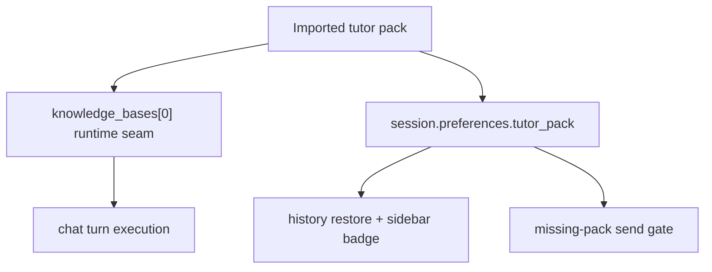

# PR Note: Playground Tutor Pack Chat

## Summary

This lane adds a product-level `Gói gia sư` concept to `/playground` chat sessions. Each session now binds to exactly one imported tutor pack, stores that binding in session preferences, restores it from history, and blocks new sends if the bound pack later becomes unavailable.

## Architecture impact

- session preferences now carry a thin `tutor_pack` binding alongside `knowledge_bases`
- `/playground` chat continues to execute against `knowledge_bases[0]` for retrieval/runtime compatibility
- session history and sidebar can now render the product-level tutor-pack identity without inferring it only from raw KB names

## MAIN_SYSTEM_MAP

`ai_first/architecture/MAIN_SYSTEM_MAP.md` was updated because this lane introduces a durable `Gói gia sư` session-binding feature in the student tutor workspace.
