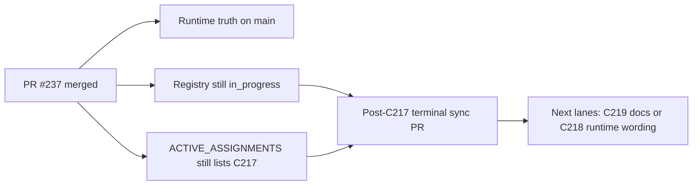

# PR Note: Post-C217 Terminal Sync

## Summary

- mark `C217_TEACHER_COCKPIT_DEFAULT_ENTRY` completed in the authoritative task registry
- clear the stale active assignment left behind after PR `#237` merged
- refresh the shortest queue mirrors so the next worker sees `C219` and `C218` instead of older pre-differentiation guidance

## Architecture Impact

- No runtime or product modules changed.
- This PR only repairs AI-first control-plane state after a merged runtime lane.
- `ai_first/architecture/MAIN_SYSTEM_MAP.md` was not updated because no system contract changed.

## Mermaid

