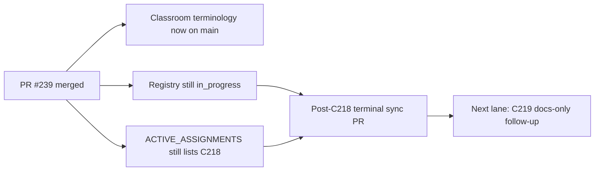

# PR Note: Post-C218 Terminal Sync

## Summary

- mark `C218_CONTEST_BRAND_AND_CLASSROOM_TERMINOLOGY` completed in the authoritative task registry
- clear the stale active assignment left behind after PR `#239` merged
- refresh the compact queue mirrors so the next worker sees `C219` as the remaining differentiation follow-up

## Architecture Impact

- No runtime or product modules changed.
- This PR only repairs AI-first control-plane state after a merged wording lane.
- `ai_first/architecture/MAIN_SYSTEM_MAP.md` was not updated because no system contract changed.

## Mermaid

