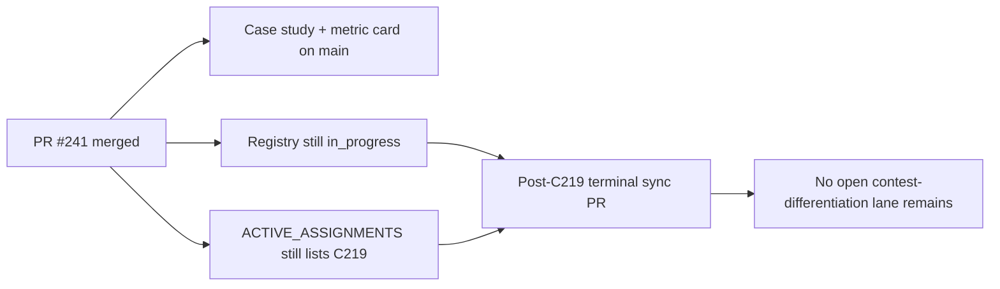

# PR Note: Post-C219 Terminal Sync

## Summary

- mark `C219_CLASSROOM_CASE_STUDY_AND_BOUNDED_METRIC_CARD` completed in the authoritative task registry
- clear the stale active assignment left behind after PR `#241` merged
- refresh the compact queue mirrors so the differentiation follow-up train is recorded as complete

## Architecture Impact

- No runtime or product modules changed.
- This PR only repairs AI-first control-plane state after a merged docs lane.
- `ai_first/architecture/MAIN_SYSTEM_MAP.md` was not updated because no system contract changed.

## Mermaid

