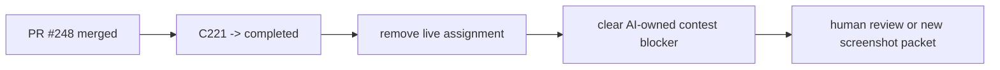

# Post-C221 Terminal Sync

## Summary

- marks `C221` completed after PR `#248` merged
- clears the stale live assignment for the merged Vietnamese-coverage lane
- returns the queue to human-review mode unless a fresh screenshot-recapture packet is explicitly opened

## Scope

- Changed:
  - `ai_first/ACTIVE_ASSIGNMENTS.md`
  - `ai_first/TASK_REGISTRY.json`
  - `ai_first/AI_OPERATING_PROMPT.md`
  - `ai_first/EXECUTION_QUEUE.md`
  - `ai_first/NEXT_ACTIONS.md`
  - `ai_first/daily/2026-04-30.md`
  - `docs/superpowers/tasks/2026-04-30-post-c221-terminal-sync.md`
  - `docs/superpowers/pr-notes/2026-04-30-post-c221-terminal-sync.md`
- Reviewed but intentionally unchanged:
  - runtime source under `web/`
  - backend code under `deeptutor/`
  - contest evidence docs

## Architecture

## Validation

- `python3 -m json.tool ai_first/TASK_REGISTRY.json >/dev/null`
- `rg -n "C221|#248|No AI-owned post-contest runtime blocker|AI-owned blockers|browser-recapture packet|human review" ai_first/AI_OPERATING_PROMPT.md ai_first/EXECUTION_QUEUE.md ai_first/NEXT_ACTIONS.md ai_first/daily/2026-04-30.md`
- `git diff --check`

## Main System Map

- No update required. This lane only closes control-plane state after a merged runtime PR.
