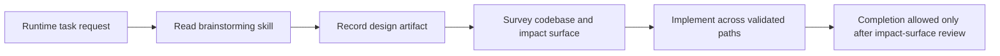

# PR Note: Runtime Task Depth Contract

## Summary

- require runtime tasks to read `.github/skills/brainstorming/SKILL.md` before implementation
- require a codebase survey and declared impact surface before runtime edits begin
- update the feature task template so large tasks cannot be closed after a shallow local edit

## Architecture Impact

- No runtime or product modules changed.
- This PR tightens the AI-first control plane and task packet contract only.
- `ai_first/architecture/MAIN_SYSTEM_MAP.md` was not updated because no product or system architecture changed.

## Mermaid

