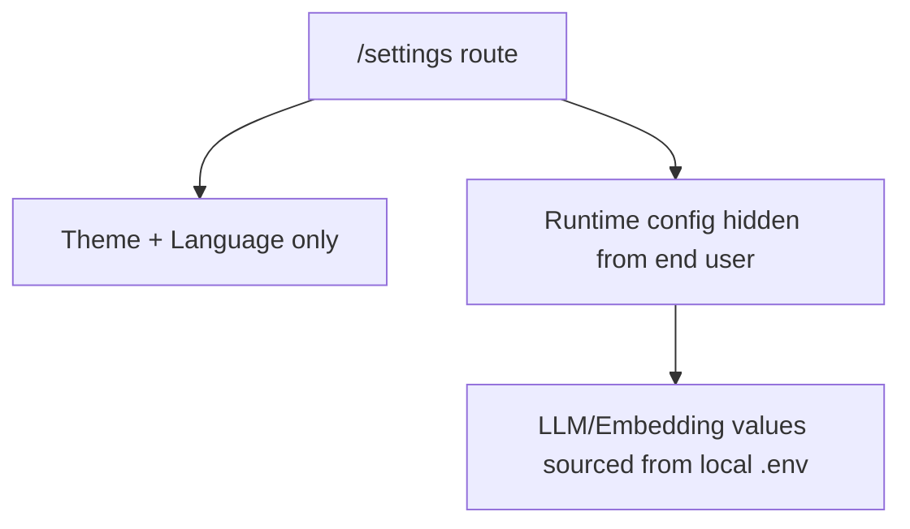

# PR Note: Settings Hide Runtime Config

This lane removes browser-visible runtime service configuration from `/settings` so end users cannot inspect or edit LLM, embedding, or search credentials and endpoints. Runtime configuration remains in local `.env` only.

- `ai_first/architecture/MAIN_SYSTEM_MAP.md` is expected to remain unchanged because this is a bounded settings-shell privacy change.
- Verification:
  - `cd web && node --test tests/settings-page-runtime-privacy.test.ts`
  - targeted eslint is currently blocked in this worktree because `eslint-config-next` is not resolvable
