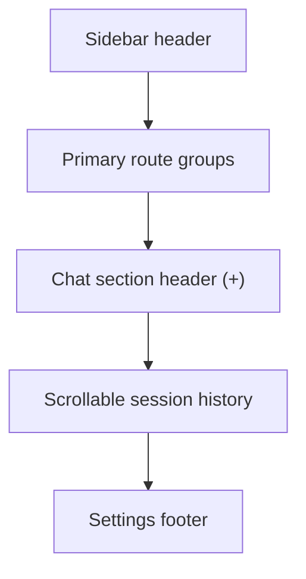

# PR Note: Sidebar Shell Rebalance

This PR rebalances the shared expanded sidebar so the route nav stays compact, the chat section owns the new-chat action, and session history gets the bulk of the available height.

## What changed

- widened the expanded sidebar shell from `220px` to `264px`
- removed the detached expanded-mode `New Chat` row from the top of the sidebar
- kept the primary route groups at the top, but tightened their vertical density
- moved chat creation into the `Trò chuyện` section header with an inline `+` action
- replaced the nested `/playground` compact session subtree with a dedicated middle history panel that scrolls independently
- left `SessionList.tsx` runtime behavior unchanged because the existing non-compact list now fits the shell cleanly

## Architecture impact

- `ai_first/architecture/MAIN_SYSTEM_MAP.md` was not updated.
- The route map and runtime data contracts stay the same; this PR only changes shared sidebar hierarchy and presentation ownership between nav and chat history.

## Verification

- `cd web && node --test tests/sidebar-shell-layout.test.ts tests/sidebar-nav-groups.test.ts`
- `git diff --check`
- targeted lint was attempted but blocked because `web/node_modules/.bin/eslint` is not available in this worktree
