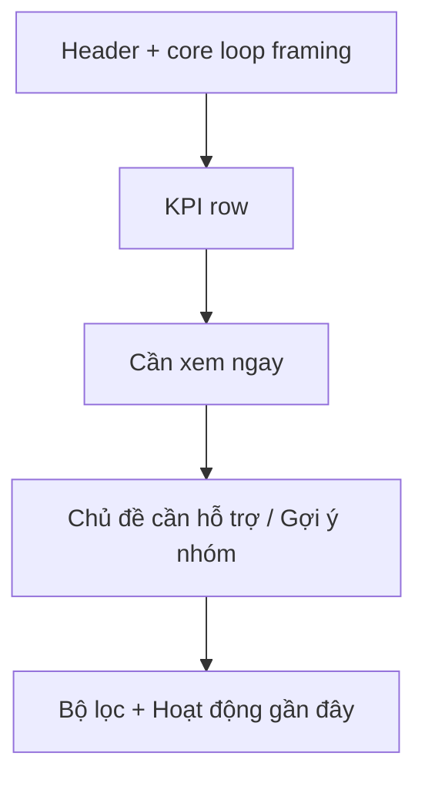

# PR Note: Teacher Dashboard Decision Flow

This PR refactors `Bảng điều khiển giáo viên` into a decision-first dashboard so urgent intervention is clearer than supporting analytics, and teacher-facing copy no longer leaks raw IDs or technical status strings by default.

## What changed

- moved the page into four clearer layers:
  - compact header
  - KPI row
  - main intervention zone
  - lower history/filter follow-up zone
- made `TeacherInsightPanel` the dominant intervention surface instead of mixing it with group recommendation cards
- redesigned `StudentInsightCard` so the default card now answers:
  - ai needs attention
  - what topic is blocked
  - what the next move should be
- demoted system rationale and secondary actions behind `Chi tiết hệ thống`
- added presenter helpers to:
  - hide raw `UNIFIED_*` student IDs
  - translate raw teacher-facing status/debug tokens into bounded Vietnamese copy
- simplified `SmallGroupInsightCard` wording so grouped intervention content stays teacher-friendly if reused

## Architecture impact

- `ai_first/architecture/MAIN_SYSTEM_MAP.md` was not updated.
- Backend dashboard contracts stayed unchanged; this PR only changes FE hierarchy and the presentation boundary in `dashboard-presenters.ts`.

## Verification

- `cd web && node --test tests/teacher-dashboard-copy.test.ts tests/teacher-dashboard-decision-flow.test.ts`
- `git diff --check`
- blocked in this worktree:
  - `./node_modules/.bin/eslint ...` because `web/node_modules/.bin/eslint` is unavailable
  - `npm run build` because `next` is not installed in PATH
