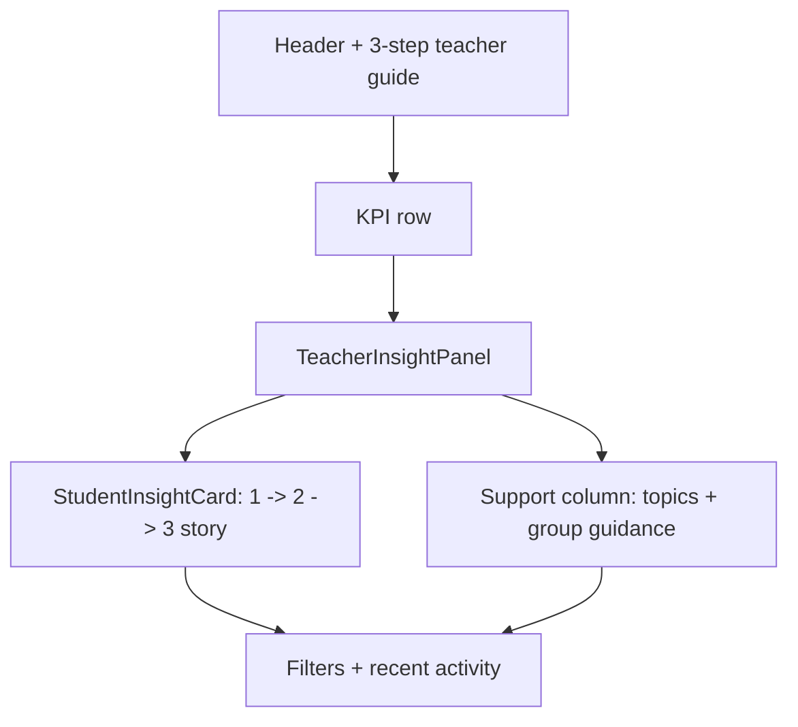

# PR Note: Teacher Dashboard Decision Flow

This PR tightens `Bảng điều khiển giáo viên` into a clearer decision flow so teachers can read the screen in a deliberate order: who needs attention now, what topic is blocked, and what move to choose next.

## What changed

- kept the main dashboard in a decision-first layout and added an explicit three-step teacher reading guide at the top
- rewrote the student card into a visible `1. Dấu hiệu -> 2. Cách hiểu -> 3. Việc làm tiếp` story before the optional `Chi tiết hệ thống` disclosure
- aligned the small-group card wording with the same evidence-to-action classroom language
- replaced the remaining English fallback guidance on the main dashboard path with Vietnamese-first copy and added locale keys for the new labels
- added a focused source-structure regression test for the dashboard decision flow

## Architecture impact

- `ai_first/architecture/MAIN_SYSTEM_MAP.md` was not updated.
- Backend dashboard contracts stayed unchanged; this PR is limited to frontend reading order, copy, and guarded UI presentation.

## Verification

- `cd web && node --test tests/teacher-dashboard-decision-flow.test.ts`
- `cd web && node --test tests/teacher-dashboard-copy.test.ts tests/contest-terminology.test.ts`
- `cd web && npx eslint "app/(workspace)/dashboard/page.tsx" "components/dashboard/TeacherInsightPanel.tsx" "components/dashboard/StudentInsightCard.tsx" "components/dashboard/SmallGroupInsightCard.tsx"`
- `cd web && npm run build`
- `git diff --check -- web/app/"(workspace)"/dashboard/page.tsx web/components/dashboard/TeacherInsightPanel.tsx web/components/dashboard/StudentInsightCard.tsx web/components/dashboard/SmallGroupInsightCard.tsx web/locales/en/app.json web/locales/vi/app.json web/tests/teacher-dashboard-decision-flow.test.ts docs/superpowers/tasks/2026-04-30-teacher-dashboard-decision-flow.md`
- residual repo-state blocker:
  - full-repo `git diff --check` is still blocked by pre-existing conflict markers in `ai_first/ACTIVE_ASSIGNMENTS.md`, outside this lane's runtime files
