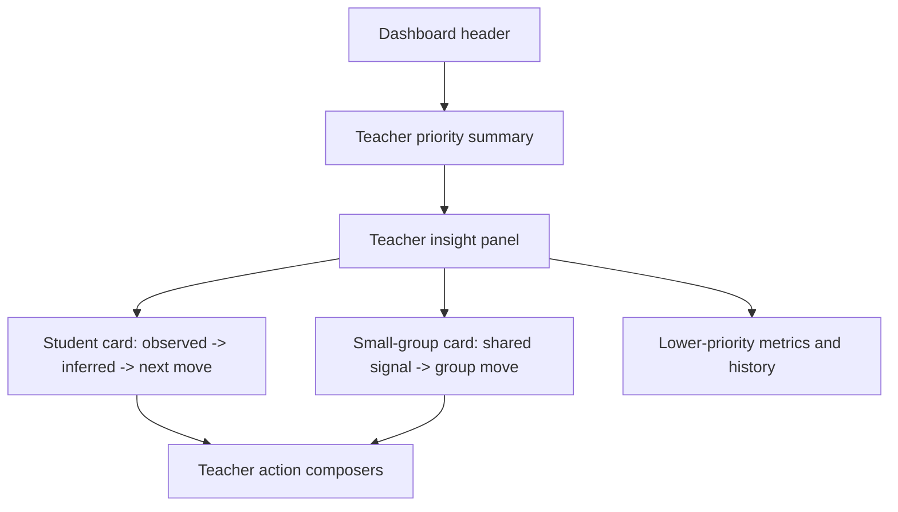

# Teacher Dashboard Refresh

## Summary

- Reframes the main teacher dashboard around what a non-technical teacher should review first.
- Rewrites primary dashboard copy into simpler Vietnamese classroom language while keeping backend payloads untouched.
- Connects observed evidence, system interpretation, and suggested intervention into a clearer narrative across student and small-group cards.

## Scope

- Changed:
  - `web/app/(workspace)/dashboard/page.tsx`
  - `web/components/dashboard/TeacherInsightPanel.tsx`
  - `web/components/dashboard/StudentInsightCard.tsx`
  - `web/components/dashboard/SmallGroupInsightCard.tsx`
  - `web/components/dashboard/dashboard-presenters.ts`
  - `web/locales/en/app.json`
  - `web/locales/vi/app.json`
  - `web/tests/contest-terminology.test.ts`
  - `web/tests/teacher-dashboard-copy.test.ts`
- Unchanged by design:
  - `deeptutor/` backend logic and dashboard payload contracts
  - dashboard child routes
  - composer submit behavior

## Architecture

## Validation

- `cd web && node --test tests/contest-terminology.test.ts tests/teacher-dashboard-copy.test.ts`
- `cd web && npx eslint "app/(workspace)/dashboard/page.tsx" "components/dashboard/TeacherInsightPanel.tsx" "components/dashboard/StudentInsightCard.tsx" "components/dashboard/SmallGroupInsightCard.tsx" "components/dashboard/dashboard-presenters.ts"`
- `cd web && npm run build`
- `git diff --check`
- `cd web && npx tsc --noEmit` currently reports an existing repo-wide test-import constraint around direct `.ts` imports; this lane follows the same established test pattern and does not add a new distinct failure category.

## Main System Map

- No update required. This lane tightens the teacher dashboard presentation layer without changing routes, contracts, or the system map.
