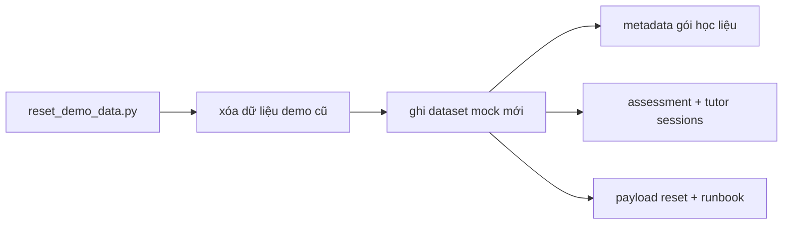

# PR Architecture Note: Demo Seed Vietnamese Refresh

## Summary

Refreshes the local contest demo seed so the visible mock dataset reads naturally in Vietnamese for teachers and students, while making the cleanup-before-reseed step explicit in the reset result and operator runbook.

## Scope

- local demo seed content only
- script result payload
- reset runbook wording
- bounded script tests

## Mermaid Diagram



## Main System Map Update

`ai_first/architecture/MAIN_SYSTEM_MAP.md` was not updated. This lane changes local demo seed content and operator-facing reset wording only.

## Validation

```bash
rtk pytest tests/scripts/test_reset_demo_data.py -v
rtk proxy /Users/nguyenhuuloc/Documents/Multiagent-learning-platform/.venv/bin/python -m scripts.contest.reset_demo_data --project-root . --api-base http://localhost:8001
rtk python3 -m compileall scripts
rtk git diff --check
```

